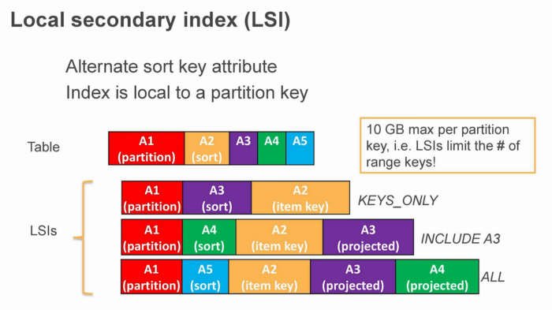
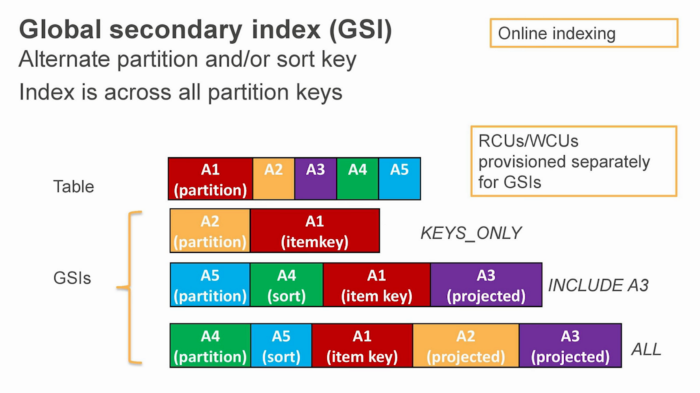
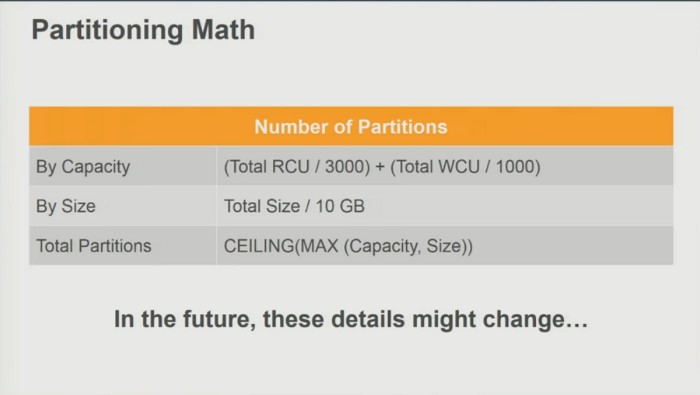
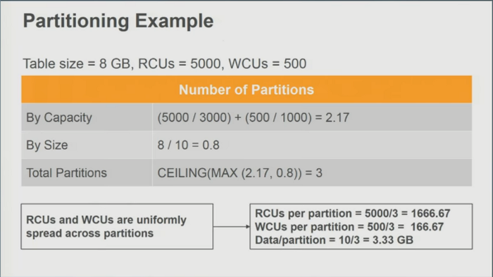

# O que é o Amazon DynamoDB?

DynamoDB é um serviço de banco de dados NoSQL fornecido pela Amazon Web Services (AWS), totalmente gerenciado, ou seja, sem necessidade
de criar infraestrutura para seu uso como faríamos utilizando o NodeJS ou o Cassandra. 

Além disso, ele suporta operações CRUD básicas e condicionais. Cada consulta no DynamoDB é executada por uma chave primária identificada 
pelo usuário que, desta forma, reconhece exclusivamente cada item.
Para o usuário da AWS interagir com o serviço, ele pode utilizar o Console de Gerenciamento da AWS — que permite, por exemplo, criar alertas, 
ajustar taxas de transferências, atualizar, excluir e consultar tabelas — ou a API do DynamoDB.

O serviço destaca-se em um cenário cada vez mais inovador e de simplificação para as empresas e profissionais de tecnologia da informação, justamente por ter duas características essenciais:
- Baixa latência: corresponde ao tempo necessário para que as alterações efetuadas sejam propagadas, ou seja, um tempo curto entre ação e reação.
- Escalabilidade: a capacidade de manipular uma porção crescente de informações de maneira uniforme e ainda assim estar preparado para crescer.

O DynamoDB é rápido e flexível para aplicações que precisam de latência constante, abaixo de 10 milissegundos, e compatível com modelos de armazenamento de documentos e de chave-valor.
Inclusive, é recomendado para aplicações móveis, web e de jogos, tecnologia de anúncios e IoT — recurso que proporciona de maneira segura a comunicação bidirecional entre dispositivos conectados à Internet e a nuvem AWS — devido ao seu modelo de dados flexível, desempenho confiável, capacidade de throughput e escalabilidade automática para a quantidade de dados transferidos.

É um banco chave-valor que suporta o tipo de dado Documento, onde pode-se armazenar um JSON.
É rápido, consistente, possui controle de acesso e event driven programming, ou seja, as
alterações nele disparam eventos que podem ser observados e utilizados em algum
serverless como Lambda.

# Segurança
Através do AWS Identity and Access Management (IAM) é permitido atribuir credenciais de segurança exclusivas e controlar o acesso aos serviços e recursos para cada usuário.
Ao mencionarmos as temidas exclusões ou inserções acidentais de arquivos, para o alívio dos profissionais de TI, existem recursos de backup e restauração point-in-time. Dá para habilitar através do Console de Gerenciamento da AWS ou API e executar cópias de segurança contínuas de sua tabela Dynamo DB até que o recurso seja desativado.

Suas vantagens são:
- Não há necessidade de se preocupar com provisionamento, configuração de clusters, drivers e hardware;
- Replicação, aplicação de patches de software ou escalabilidade de clusters;
- Oferece criptografia de repouso, ou seja, elimina a carga e a complexidade  operacionais na proteção de dados confidenciais;
- Pode-se criar tabelas de banco de dados que armazenam e recuperam qualquer quantidade de dados e atendem a todos os níveis de tráfego solicitados;
- É possível aumentar ou diminuir a capacidade de throughput da tabela sem tempo de inatividade ou degradação do desempenho;
- É possível monitorar a utilização de recursos e métricas de desempenho;
- Oferece o recurso de backups completos sob demanda para retenção e arquivamento de longo prazo conforme as necessidades;
- Tem o recurso de recuperação point-in-time das tabelas que ajudam a protege-las de operações acidentais de gravação ou exclusão;
- Com o recurso point-in-time é possível restaurar uma tabela para qualquer ponto durante os últimos 35 dias;
- Permite a exclusão automática dos itens com o vida útil (TTL) expirados em tabelas, de modo a ajudar na redução de uso e custo do armazenamento de dados irrelevantes.
- Tempo de resposta consistente e rápido mesmo com grande quantidade de armazenamento e requisitos de throughput;
- Todos os dados são armazenados em discos de estados sólido (SSD), no formato de tabelas que interagem por meio de consultas GET e PUT que são operações de leitura e gravação, respectivamente.
- Dados são automáticamente replicados através de várias zonas de disponibilidade em uma região da aws,proporcionando maior durabilidade de dados e 
disponibilidade de integração;
- É possível usar tabelas globais para manter as tabelas do DynamoDB em sincronia em todas as regiões da aws;
- Precificação por hora de capacidade provisionada e dados armazenados através de CUs, no momento da criação da tabela;
- POssibilidade de moficação da capacidade manualmente ou automaticamente

Contudo nem tudo são flores. Algumas desvantagens:
- É preciso bom entendimento de como ele funciona pois se usado de maneira errada pode resultar em perda de performance e alto custo para mante-lo;
- É usado o Capacity Unit (CU), que é uma medida utilizada para cobrar pelo serviço de leitura e escrita.
- Curva de aprendizado ingreme para entender o design de tabela única;
- Inflexibilidade de adicionar novos padrões de acesso;
- A dificuldade de exportar as tabelas para análise

# Preço
Os valores podem sofrer variações de acordo com a capacidade máxima e mínima desejada, especificações, utilização do serviço e região. Há uma questão muito importante: o DynamoDB altera automaticamente a escala de acordo com a sua utilização e processa o provisionamento de recursos.
A AWS também disponibiliza uma versão gratuita com 25GB de armazenamento e até 200 milhões de solicitações por mês.
Uma dica é fazer reserva de capacidade de unidades de escrita e leitura do DynamoDB que são usadas de forma ininterrupta no mês e assim atingir uma economia de até 50% neste recurso!

# Funcionamento

O DynamoDB utiliza chaves primárias para identificar exclusivamente cada item em uma tabela e índices secundários para fornecer mais flexibilidade de
consulta.
Assim como os bancos de dados relacionais pode-se criar uma tabela que possui itens com n produtos. No entanto, cada item pode ter no máximo 400KB
O diagrama a seguir mostra uma tabela People com alguns itens,sendo que cada item representa uma pessoa e e cada item é composto por um ou mais atributos.

Fonte: amazon.aws

# Chaves Primária e Compostas

O único atributo obrigatório é a Partition Key, semelhante a chave primária de um banco relacional. Opcionalmente também podemos criar um segundo atributo entre outros.
Quando Partition Key e Sort Key são combinadas, é criada uma chave composta, onde a Partition Key pode ser repetida desde que a Sort Key seja diferente.

O DynamoDb é compatível com dois tipos de diferentes de chaves primárias:
- Chave de partição: é uma chave primária simples, composta por um atributo conhecido como chave de partição. Em uma tabela que possui somente uma chave de 
partição, dois itens não podem ter o mesmo valor de chave de partição. Exemplo: A tabela People descrita em Tabelas, itens e atributos é um exemplo de uma tabela com uma chave primária simples (PersonID). Você pode acessar diretamente qualquer item na tabela People fornecendo o valor PersonId para esse item.
- Chave de partição e chave de classificação: conhecidas como chaves primárias compostas, esse tipo de chave é composto por dois atributos. O primeiro atributo é a chave de partição, e o segundo atributo é a chave de classificação.

No exemplo abaixo, temos uma tabela de música, onde temos o artista como Partition key e o nome da música como Sort Key, você pode recuperar uma música imediatamente se
fornecer os dois valores. Essa combinação ainda trás mais flexibilidade ao executar uma query. Você pode por exemplo buscar apenas pelo artista e já recuperar toda as músicas dele.

Fonte: amazon.aws

Partitions Keys são identificadores únicos e são usados para criar um hash aleatório e permite que a tabela seja particionada para escalar.

# Caracteristicas do banco

- Cada tabela possui 3 réplicas;
- O commit só é confirmado após o dado ter sido gravado em 2 réplicas;
- As leituras são eventualmente consistentes. Caso você queira uma leitura consistente é necessário informar na hora da consulta. Então ao invés da consulta
ser feita em uma replica será feita em duas, utilizando 2 CUs ao invés de 1.

# Indices

A figura abaixo demonstra como é o Local Secondary Index (LSIs)

- Partition key é sempre a mesma
- Você pode criar Sort Keys alternativas
- Limitado a 10GB por partição
- Quanto mais atributos existir nesse index mais Capacity Unit será usado
- Deve ser criado no momento da criação da tabela

A figura abaixo demonstra como é o Global Secondary Index (GSI)

- Você pode utilizar outros atributos como Partition Key que não precisa ser única
- Podemos pensar nela como uma shadow ou powerlow table
- Devemos usar quando a tabela tiver mais que 10GB
- Completamente separada da tabela principal
- Eventualmente consistente, ou seja, os dados podem ainda não ter sido atualizados. Isso ocorre porque os indexes são atualizados somente após o registro ser adicionado e confirmado. Então quando a consulta for realizada, mesmo informando que deseja consistente, o índice pode não ter sido atualizado.

# Como escalar

Para escalar são criadas partições por throughtput ou tamanho sendo que a cada 10GB(Limite da LSI), uma nova partição é criada.

Unidades de capacidade
- Read Capacity Unit ou RCU (Capacidade de Leitura), representa uma leitura consistente ou duas leituras eventualmente consistente por
segundo, para um item de 4 KB, caso seja maior o DynamoDB irá consumir mais.
- Write Capacity Unit ou WCU (Capacidade de Escrita), Representa uma escrita por segundo, para um item de 1 KB, caso seja maior o
DynamoDB irá consumir mais.

A conta para criar partições é mostrado na figura abaixo:

Exemplificando. Uma tabela com 8 GB e capacidade de leitura de 5000 e 500 de escrita terá 3 partições, conforme imagem abaixo.

